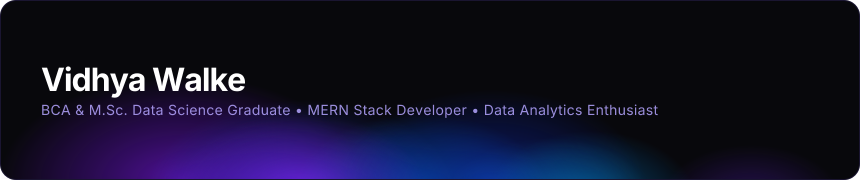

***

## About Me

MERN stack developer with an M.Sc. in Data Science. Most of my work sits where web development meets data. It could be connecting an ML model to a live web app, setting up a backend that holds up, or making a frontend people actually enjoy using.

🔹 **Full-Stack Developer** · MERN stack from database design to React UI\
🔹 **Data Science Graduate** · ML pipelines, analytics, EDA, and predictive modelling\
🔹 **AI Integration** · Connecting machine learning to real, working web applications\
🔹 **Clean Code Mindset** · Modular, readable, and documented so it stays maintainable\
🔹 **Fast Learner** · New stack, new tool? I figure it out quickly

Open to entry-level roles in data analytics, data science, or full-stack development. Also up for freelance and open-source work.

## 💭 How I Think About Building

*"Getting something to work is step one. Getting it to work well — cleanly, thoughtfully, and without making future-you want to cry — that's the actual job."*

A few things I genuinely care about:

* **Purpose over padding** — if a line of code doesn't earn its place, it doesn't belong there
* **Build for people, not specs** — the best solution is the one users don't have to think about
* **Iteration over perfection** — the first version is supposed to be rough; what matters is how fast you learn from it
* **Write it down** — code without context is just a riddle waiting to frustrate someone (usually yourself, six months later)
* **AI as a tool, not a crutch** — most useful when you already know what you're trying to do

## What I Work With

**Data Science & ML**
`Python` · `NumPy` · `Pandas` · `Scikit-learn` · `Matplotlib` · `Seaborn` · `LightGBM` · `Power BI` · `MySQL` · `MongoDB`

**Full-Stack Web Development (MERN)**
`MongoDB` · `Express.js` · `React` · `Node.js` · `HTML` · `CSS` · `JavaScript`

**Tools & Platforms**
`Git` · `GitHub` · `VS Code` · `Kaggle` · `Jupyter Notebook`

## Featured Work

Pinned repositories below cover ML pipelines, data analysis notebooks, and full-stack apps.

* **ML Projects**: Classification and prediction pipelines with model evaluation
* **Data Analytics**: EDA and visualization notebooks, also published on [Kaggle](https://www.kaggle.com/vidhyaw)
* **MERN Apps**: Full-stack web applications built with MongoDB, Express, React, and Node.js

## Right Now

* Shipping AI-integrated web apps with a focus on real, measurable impact
* Getting deeper into React architecture and scalable state management
* Tightening up backend design — performance, structure, and long-term maintainability
* DSA practice (consistent, not occasional)

***

## Let's Connect

[LinkedIn](https://linkedin.com/in/vidhyawalke)  ·  [Email](mailto:vidhya.walke.official@gmail.com)  ·  [Kaggle](https://www.kaggle.com/vidhyawalke)  ·  [Blog](https://vidhyawalke.blogspot.com/)

***

  🌟 If something here was useful or interesting, a star on the repo means a lot. 
  🤝 Up for freelance work, open-source collabs, or full-time roles — feel free to reach out.

<i>"Building today to become better than yesterday."</i>

